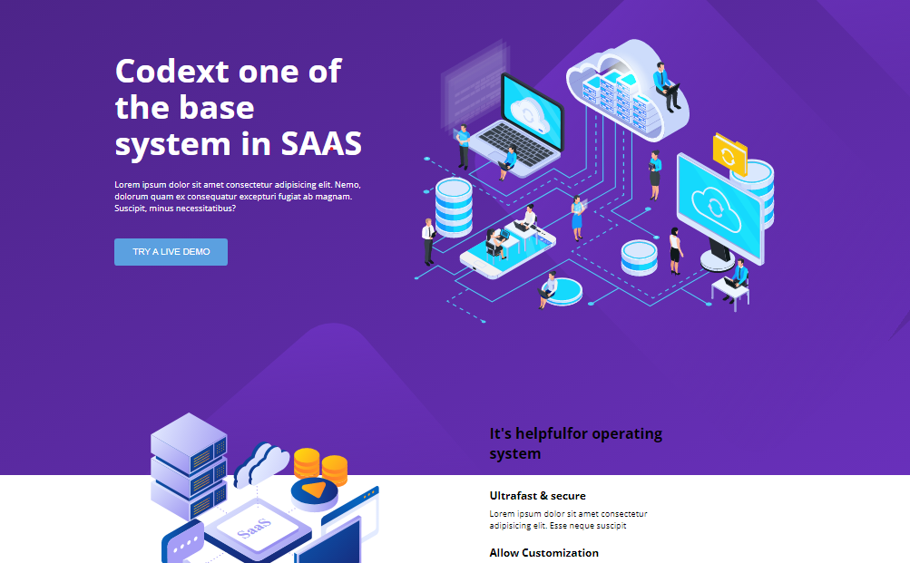
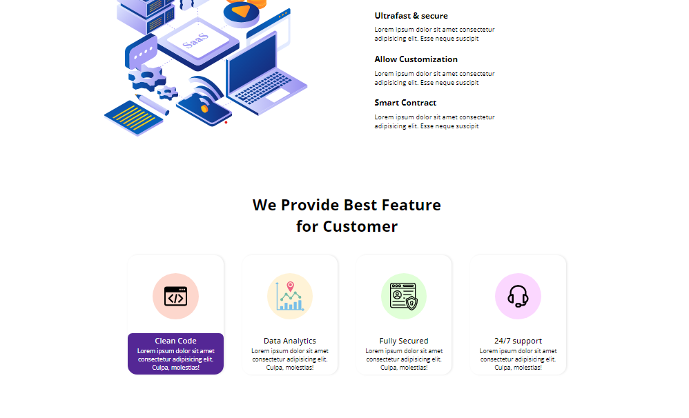

# Assignment

## Project 13 [Live Link](https://samdish-live-class-project-15.netlify.app)

-   Skills Gained in this project
    -   Learned to create background box for visual design.
    -   Learned to use external fontawesome icon library
    -   Gained indepth knowledge of flexbox.

---

## Time taken to finish this project

-   Approximately 5 hour taken to complete this project.

#### Preview

